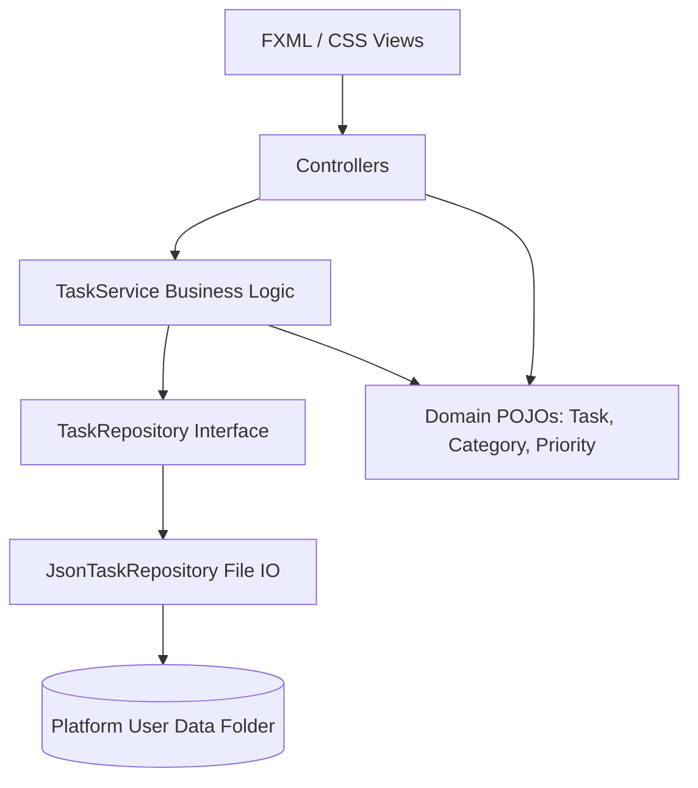

# TaskManager

[](https://github.com/roydibyajyoti/TaskManager/actions/workflows/build-release.yml)
[](LICENSE)
[](https://www.oracle.com/java/)
[](CONTRIBUTING.md)

TaskManager is a premium, native-feeling desktop productivity suite built using **Java 17+**, **JavaFX**, and **Maven**. Adhering strictly to Clean Architecture (MVC) and modern UX guidelines, it offers a desktop environment inspired by productivity leaders like Linear, Notion, and JetBrains.

---

## Key Features

- 📊 **Metric Dashboard**: Real-time stats cards, task completion rates (progress bar), and distribution breakdowns mapped by category and priority.
- 📋 **Reactive Task List**: Complete sorting, real-time query searching, inline checkboxes to toggle completion states, and warning indicators for due dates (Today/Overdue).
- 🏷️ **Custom Category Tagging**: Dynamic tags with custom name colors. Deleted categories automatically cascade tasks to "Uncategorized".
- 🌓 **Instant Theme Switching**: Runtime Light & Dark mode toggle. Design tokens (colors, borders, glows) transition instantly without requiring application restart.
- 💾 **Platform-Native Persistence**: Data auto-saves to platform-conforming application support folders:
  - **macOS**: `~/Library/Application Support/TaskManager/`
  - **Windows**: `%APPDATA%\TaskManager\`
  - **Linux/Unix**: `~/.config/TaskManager/`
- 🍎 **macOS HIG Alignment**:
  - Global macOS menu bar integration (`useSystemMenuBar="true"`).
  - Native Dock naming and process identification (`TaskManager` instead of `Java`).
  - Native Command accelerators (`Shortcut` key mappings).
  - Apple Menu event overrides (routing "About TaskManager" and "Preferences" to custom layouts).
- 🎨 **Polished UX & Vector Graphics**: Flat layout alignments, non-shifting inline form validation error lines, and customized flat combo box dropdowns and vector SVG icon graphics.

---

## Project Architecture

TaskManager is designed with strict Separation of Concerns:



---

## Directory Structure

```text
TaskManager/
├── pom.xml                               # Maven project configuration
├── LICENSE                               # MIT License
├── README.md                             # Repository README
├── CHANGELOG.md                          # Release history
├── CONTRIBUTING.md                       # Contribution guidelines
├── CODE_OF_CONDUCT.md                    # Community standards
├── SECURITY.md                           # Security reporting policy
├── make_icns.sh                          # App icon compiler script
├── docs/
│   └── release_guide.md                  # Release release manual
├── screenshots/
│   └── README.md                         # Showcase image placements
└── src/
    ├── main/
    │   ├── java/                         # Java MVC classes
    │   └── resources/                    # FXML views, CSS styles, icons
    └── test/
        └── java/                         # JUnit test suites
```

---

## Installation & Development Setup

### Prerequisites
- **Java Development Kit (JDK)**: Version 17 or higher.
- **Apache Maven**: Version 3.6 or higher.

### Steps
1. **Clone the repository**:
   ```bash
   git clone https://github.com/roydibyajyoti/TaskManager.git
   cd TaskManager
   ```
2. **Compile and build dependencies**:
   ```bash
   mvn clean compile
   ```
3. **Run the application locally**:
   ```bash
   mvn javafx:run
   ```
4. **Run automated test suites**:
   ```bash
   mvn test
   ```

---

## Native Desktop Packaging (jpackage)

This repository includes pre-configured packaging profiles inside `pom.xml` using the native JDK `jpackage` tool to build native, self-contained installers.

### 🍎 macOS (.app and .dmg)
1. **Generate `.icns` icon file**:
   ```bash
   chmod +x make_icns.sh
   ./make_icns.sh
   ```
2. **Compile the installers**:
   ```bash
   mvn clean package -Ppackage-mac
   ```
   Outputs: `target/dist/TaskManager.app` and `target/dist/TaskManager.dmg`.

### 🏁 Windows (.exe and .msi)
*Requires [WiX Toolset v3](https://wixtoolset.org/) installed and configured on the system PATH.*
1. **Compile the installers**:
   ```bash
   mvn clean package -Ppackage-win
   ```
   Outputs: `target/dist/TaskManager.exe` and `target/dist/TaskManager.msi`.

### 🐧 Linux (.deb and .rpm)
*Requires `rpm` and `alien` package tools installed on the build machine.*
1. **Compile the installers**:
   ```bash
   mvn clean package -Ppackage-linux
   ```
   Outputs: `target/dist/taskmanager.deb` and `target/dist/taskmanager.rpm`.

---

## CI/CD Pipeline

The project uses GitHub Actions to automate testing and release creation across macOS, Windows, and Linux. For tag pushes matching `v*`, the pipeline will automatically compile all native installers, assemble them, and publish a draft release.

Refer to the [GitHub Actions workflow](.github/workflows/build-release.yml) and the [Release Guide](docs/release_guide.md) for more details.
