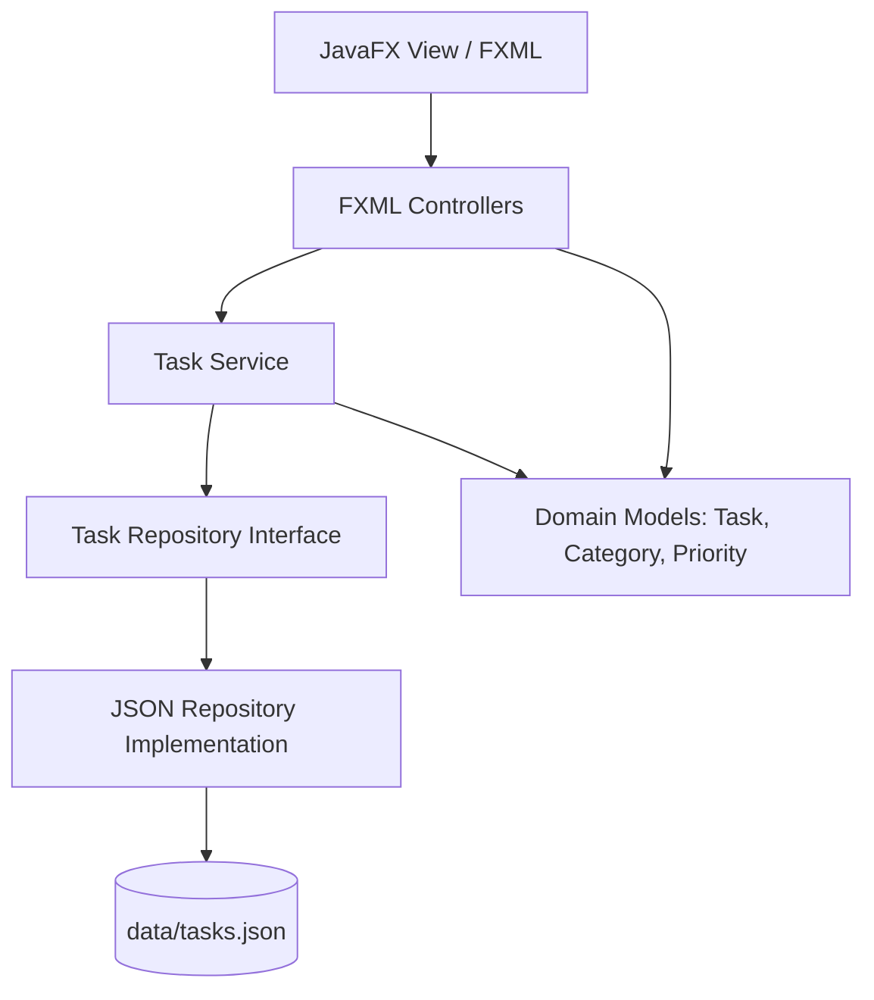

# Task Management System - Implementation Plan

We will build a modern, professional desktop Task Management System using Java 17+, JavaFX, and Maven. The project will adhere to Clean Architecture, SOLID principles, the MVC pattern, and professional UI/UX design guidelines.

## User Review Required

> [!IMPORTANT]
> **Environment Prerequisites:**
> - Maven (`mvn`) is not installed on your system PATH. However, Homebrew is installed.
> - We propose running `/opt/homebrew/bin/brew install maven` to set up Maven before we build the project.
> - Please approve the Maven installation or let us know if you prefer another method (e.g., a local Maven wrapper).

## Proposed Architecture

We will implement a Clean MVC (Model-View-Controller) architecture separated into layers:
1. **Model Layer**: Plain Java Objects (POJOs) representing domain concepts (`Task`, `TaskCategory`, `PriorityLevel`).
2. **Repository Layer**: Handles persistence logic. We will build a file-based JSON repository (`JsonTaskRepository`) using Jackson.
3. **Service Layer**: Manages business logic (validation, search, filtering, statistics calculation).
4. **Controller Layer**: Handles GUI interaction. JavaFX controllers bound to FXML views.
5. **View Layer**: FXML files for structure, CSS stylesheets for design (Light/Dark themes).



---

## Project Folder Structure

We will create the following layout:

```text
guiTaskManager_java/
├── pom.xml
├── data/
│   └── tasks.json (Auto-generated local persistence)
├── src/
│   ├── main/
│   │   ├── java/
│   │   │   └── com/
│   │   │       └── taskmanager/
│   │   │           ├── Launcher.java (JavaFX main launcher workaround)
│   │   │           ├── App.java (JavaFX Application class)
│   │   │           ├── model/
│   │   │           │   ├── Task.java
│   │   │           │   ├── TaskCategory.java
│   │   │           │   └── PriorityLevel.java
│   │   │           ├── repository/
│   │   │           │   ├── TaskRepository.java
│   │   │           │   └── JsonTaskRepository.java
│   │   │           ├── service/
│   │   │           │   └── TaskService.java
│   │   │           ├── controller/
│   │   │           │   ├── MainController.java
│   │   │           │   ├── TaskDialogController.java
│   │   │           │   └── CategoryDialogController.java
│   │   │           └── util/
│   │   │               └── JsonUtils.java
│   │   └── resources/
│   │       └── com/
│   │           └── taskmanager/
│   │               ├── fxml/
│   │               │   ├── main.fxml
│   │               │   ├── task_dialog.fxml
│   │               │   └── category_dialog.fxml
│   │               └── css/
│   │                   ├── style.css
│   │                   └── dark.css
│   └── test/
│       └── java/
│           └── com/
│               └── taskmanager/
│                   ├── service/
│                   │   └── TaskServiceTest.java
│                   └── repository/
│                       └── JsonTaskRepositoryTest.java
```

---

## Class Design

### Domain Models
- `PriorityLevel`: Enum (`LOW`, `MEDIUM`, `HIGH`, `CRITICAL`) with display properties (color codes, labels).
- `TaskCategory`: Entity (`id`, `name`, `colorCode`) representing tags like "Work", "Personal", "Urgent".
- `Task`: Entity (`id`, `title`, `description`, `dueDate`, `priority`, `categoryName`, `completed`, `createdAt`).

### Services & Persistence
- `TaskRepository`: Interface defining CRUD operations for tasks and categories.
- `JsonTaskRepository`: Concrete class implementing `TaskRepository`, saving to `data/tasks.json`.
- `TaskService`: Provides core logic for validation, searching by title/desc, filtering by category/priority/completion, and computing dashboard stats.

---

## UI/UX Design

The application will feature a modern, responsive layout:
1. **Sidebar Navigation**:
   - Navigation links: **Dashboard**, **Tasks**, **Categories**, **Settings**.
   - Theme Toggle (Dark/Light mode switch).
2. **Dashboard View**:
   - Cards showing key metrics: Total Tasks, Completed, Pending, Overdue.
   - Task completion rate (progress bar).
   - Priority and Category breakdown.
3. **Tasks List View**:
   - Search bar (dynamic filtering as you type).
   - Filter dropdowns (Category, Priority, Status).
   - Table view showing: Title, Category, Priority (color-coded badge), Due Date, Status (Checkbox).
   - Toolbar buttons: Add Task, Edit Task, Delete Task, Mark Complete.
4. **Dialogs**:
   - **Task Dialog**: Clean input forms for Add/Edit. Title, Description, Due Date (DatePicker), Priority (ComboBox), Category (ComboBox). Custom inline error indicators for validation.
   - **Category Dialog**: Manage custom categories, pick hex colors, add/delete.
   - Professional confirmation/alert dialogs.

### Visual Styling (CSS)
- **Glassmorphism-inspired components** and clean shadows.
- Vibrant, tailored color schemes:
  - High Priority: Crimson Red (#EF4444)
  - Medium Priority: Amber Orange (#F59E0B)
  - Low Priority: Emerald Green (#10B981)
  - Critical Priority: Purple (#8B5CF6)
- Fully dynamic theme switching without requiring application restart.

---

## Verification Plan

### Automated Tests
We will write unit and integration tests using JUnit 5:
- **`TaskServiceTest`**: Validates search, filters, statistics computation, and validation rules.
- **`JsonTaskRepositoryTest`**: Validates file I/O, CRUD operations, handling of empty/corrupt files.

### Manual Verification
- We will compile and run the application:
  `mvn clean compile javafx:run`
- We will test the GUI interactions:
  - Adding a new task, editing, and deleting.
  - Adding categories, selecting them in the task form.
  - Verifying real-time searches and status/priority filters.
  - Switching between Light and Dark mode.
  - Verifying the data persists across app restarts in `data/tasks.json`.
